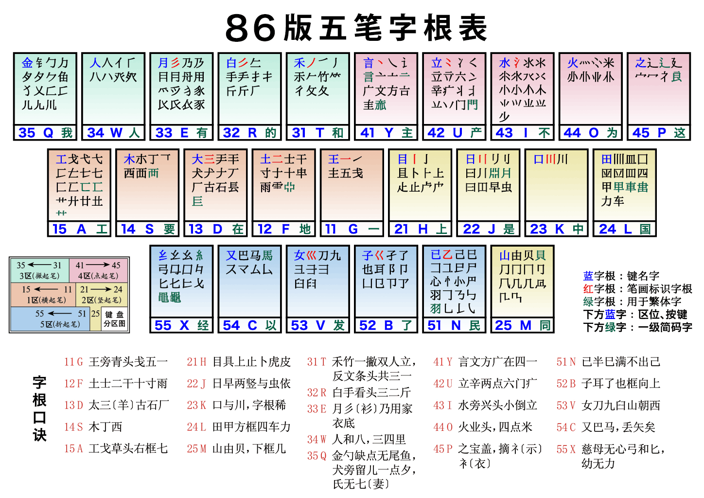

# 五笔

## 笔画、字根和结构概念

**笔画**是汉字中书写时不间断的线条，在五笔中则成为字根归区的依据，它包括1横区（11g，12f，13d，14s，15a），2竖区(21h，22j，23k，24l，25m)，3撇(31t，32r，33e，34w，35q)区，4捺区(41y，42u，43i，44o，45p)，5折区(51n，52b，53v，54c，55x)，其中字母前的两个数字分别表示区号和位号，如11表示第一区的第一个字母，即字母g，这种什么区包括什么字根有一定的理据性，但更多的是人为规定，不必强行找出规律。

五笔字根是由汉字的笔画组成，在五笔中是组成汉字的最基本的单位，在五笔中任何汉字都可以用最多四个字根代码打出来，这些字根分布在笔画五大区里面，可分为**键名字根，成字字根和不成字字根：**

- **键名字根**是每个键位排在第一的字根，它们本身就是汉字，由它形成的汉字可以连按这个键位四下确定，如“王”字，它排在G键的第一个，那它的五笔编码连按四下G键，即"GGGG"。

- **成字字根**是本身也是汉字的非键名字根，它没有排在键位的第一个，输入方法是键名代码+首笔代码+次笔代码+末笔代码，如手(RTGH)，先报“户口”，即输入所在键位R，然后按顺序输入首笔代码T，次笔代码G，以及末笔代码H就可以打出来。

- **不成字字根**指本身不是完整的汉字，需要和其它的成字或者不成字字根结和才能够形成汉字，这种与不成字字根结合的成字方式分为三种情况：

1. 一种是拆不够四个字根，若这个字没有重码(不同的字有着相同的编码，如捶和揰编码都是rtgf,它们就是重码字)，可以做为简码字直接打出来，若有重码，则就要引入**末笔识别码**，首先打完这个字的字根，再追加一个末笔码，末笔码是通过一个汉字的末尾的笔画结构(1横、2竖、3撇、4捺、5拆）)和整体的字型结构(1左右型、2上下型、3杂和型)所确定的编码，如"好"，它的末笔是"一"，在横区，区号是1，结构是左右型，位号是1，则它的末笔编码区位号是11，即字母g，整体的编码是"VBG"。
2. 第二种是刚好四个字根组成一个汉字，则四个编码则是四个字根，如"泽"的编码是"ICFH"。
3. 第三种情况是超过四个字根，则输入方式是首笔字根+次笔字根+次次笔字根+末笔字根，如"赞"，五笔编码为"TFQM"。

## 字根分布

因为暂时没有找到如何输入某些字根的方法，所以下面的字根是不全的，并且因为有些字根是在部首偏旁的基础上加以裁剪修改而成的，所以通过先输入部首再描述取哪个部分以此来描述不能打出来的字根。

- 11G:王(GGGG)、一(G)、五(GGH)、**戋(GGGT)**、青(GEF)头
- 12F:土(FFFF)、士(FGHG)、干(FGGH)、二(FGG)、十(FGH)、寸(FGHY)、雨(FGHY)、革(AF)底
- 13D:大(DDDD)、犬(DGTY)、古(DGHG)、石(DGTG)、三(DGGG)、**髟(DET)左部**
- 14S:木(SSSS)、丁(SDH)、西(SGHG)
- 15A:工(AAAA)、匚(AGN)、**艹(AGHH**)、七(AGN)、**戈(AGNT)**、弋(AGNY)
- 21H:目(HHHH)、丨(HHLL)、卜(HHY)、虍(HAV)头、上(HHGG)头、止(HHHG)、**疋(HNI)下部**
- 22J:日(JJJJ)、早(JHNH)、**刂(JHH)**
- 23K:口(KKKK)、川(KTHH)
- 24L:田(LLLL)、甲(LHNH)、四(LGNG)、车(LGNH)、力(LTN)
- 25M:山(MMMM)、由(MHNG)、冂(MHN)、几(MTN)、贝(MHNY)、骨(MEF)头
- 31T:禾(TTTT)、竹(TTGH)、丿(TTLL)、攵(TTGY)、**彳(TTTH)**
- 32R:白(RRRR)、手(RTGH)、**扌(RGHG)**、斤(RTTH)
- 33E：月(EEEE)、用(ETNH)、丹(MYD)、采(ES)头、衣(YE)底、家(PE)底
- 34W:人(WWWW)、**亻(WTH)**、八(WTY)
- 35Q:金(QQQQ)、钅(QTGN)、鱼(QGF)头、夕(QTNY)、氏(QAV)无七、**犭(QTE)无横**、**饣(QNB)无底**、**勹(QTN)**、义(YQ)无点
- 41Y:言(YYYY)、丶(YYLL)、文(YYGY)、方(YY)、**讠(YYN)**、广(YYGT)、高(YMK)头、亠(YYG)
- 42U:立(UUUU)、六(UYGY)、辛(UYGH)、**冫(UYG)**、**丬(UYGH)**、**疒(UYGG)**、门(UYH)
- 43I:水(IIII)、**氵(IYYG)**、小(IH)
- 44O:火(OOOO)、业(OG)头、**灬(OYYY)**、米(OY)
- 45P:之(PPPP)、**冖(PYN)**、**礻(PYI)无撇**
- 51N:已(NNNN)、羽(NNYG)、心(NYNY)、尸(NNGT)
- 52B:子(BBBB)、**阝(BNH)**、凵(BNH)、卩(BNH)、也(BN)、耳(BGH)、巛(VNNN)少一个直角
- 53V:女(VVVV)、刀(VNT)、九(VNT)、巛(VNNN)、**彐(VNGG)**、臼(VTHG)
- 54C:又(CCCC)、巴(CNHN)、马(CN)
- 55X:**纟(XXXX)**、幺(XNNY)、弓(XNGN)、匕(XTN)、母(XGU)无内

## 简码字、词组的编码以及特殊键

**简码字**是指一些常用的字可以用一个、二个、三个字母打出来，称为一、二、三级简码，简码和末笔识别码区别：首先它们目的不同，简码是为了方便打出常用字而设置的,可以不遵守拆字规则，如"我"，用一级简码表示为"q",实际拆字为"TRN"，而末笔识别码是为了区分重码而设立的，如习(NUD)和飞(NUI)的区分，其次，简码不需要将字根全部打完，如蝶(JAN)，只打出了前三个字根，但是末笔识别码需要全部打完。

 **词组**在五笔中可以分为双字词、三字词、三字词、四字词、多字词；双字词取第一个和第二个字前两个编码，如革命(AFWG)；三字词取第一字的第一个编码、第二个字的第一个编码和第三个字的前两个编码，如毛泽东(TIAI)；四字编码则分别每个字的第一个编码，如无产阶级(FUBX)；多字词取一、二、三、末字的第一个编码，如中国工产党(KLAI)。

 **特殊键**可以分为Z键和L键：

- Z键是没有字根分布的键位，在不确定字根时，可以将其输入进去作为填充。

- L键可以用来输入横、竖、撇、捺、拆五笔画，如一(GGLL)、丨(HHLL)、丿(TTLL)、丶(YYLL)、乙(NNLL)

  >### “Z”键[[编辑](https://zh.wikipedia.org/w/index.php?title=五笔字型输入法&action=edit&section=17)]
  >
  >由于五笔字型中，采用五种笔划，每个字根或码元只取前两划定位它们在键盘上的位置，所以五笔字型汉字编码只用到了5×5＝25个字母键。每个字的编码中都没有“Z”。后来大部分五笔输入软件都附与Z键查询功能，又叫作“万能键”或“万能学习键”。初学者可以在对某个字不确定其拆分时，使用“Z”键代替不确定的字根或码元。也有一些五笔输入法使用“Z”键来实现拼音反查五笔或符号输入功能。早期DOS系统中Z键可以用在任何位置，然现今大多数五笔输入法中Z键均无法在首位作为不确定的字根代替码。一些输入法中若在首位输入Z则跳出特殊符号选择列表。
  >
  >### “L”键[[编辑](https://zh.wikipedia.org/w/index.php?title=五笔字型输入法&action=edit&section=18)]
  >
  >与“Z”键的用途为大多数熟知不同，“L”键在五笔编码中也有许多人不太了解的特殊用途：
  >
  >- 单笔画字
  >
  >  编码方案对单笔画字的编码规定为“两个单笔画字母加两个L”，如一（GGLL）、丨（HHLL）、丿（TTLL）、丶（YYLL）、乙（NNLL）。由于竖、撇、捺构成的字不为大多数人认识，而“一”字有一级简码（G），乙字又不常用（偶尔用到时，一般不记得正确编码的输入者常会用别的输入法代替输入），所以这一编码方案细节常被人忽略。
  >
  >- 解决某些重码问题
  >
  >  词组“劳动”与“蔻”字，如果按编码方案，其编码均为（APFC），因早期的五笔输入法不支持词组与单字重码，按照一般的规定，重码时应是以单字优先，可是相比之下，“劳动”是常用词，而“蔻”字几乎不会单独出现，通常总是以词组“豆蔻”的形式出现，所以，为了方便输入以及减少重码，在最终方案中蔻字的编码被强制设为（APFL），但近年来因五笔输入法支持词组与单字重码，部分输入方案已将“蔻”字编码改为APFC。
  >
  >类似地，早期版本的五笔将“靥”字的编码强制设为（DDDL），以避免和键名字“大”（DDDD）重复.

